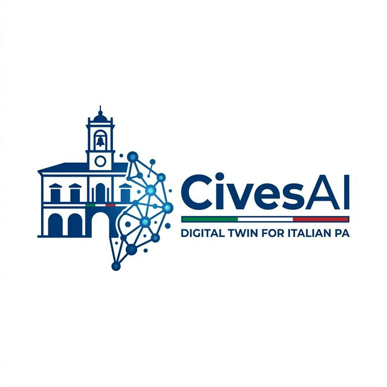

<div align="center">



### **CivesAI: The Digital & Predictive Twin for Public Administration**

*High-fidelity multi-agent simulation for public policy optimization and citizen engagement.*

[](https://opensource.org/licenses/AGPL-3.0)
[](https://www.python.org/)
[](https://nodejs.org/)
[](https://ollama.ai/)

[Italiano](./README.md) | [English](./README-EN.md)

</div>

---

## ⚡ Project Overview

**CivesAI** is a predictive multi-agent simulation engine designed specifically for local public administration entities. By extracting seed information from the real world — such as demographic data, policy drafts, budgets, and local news — CivesAI constructs a **high-fidelity parallel digital world**.

In this ecosystem, thousands of agents with independent personalities, long-term memory, and unique behavioral logic interact and evolve autonomously. **Administrators and policy-makers** can operate within this digital "sandbox," injecting new variables (e.g., changes to traffic zones, tax restructuring, new construction sites) to:

- **Accurately Predict Reactions** of public opinion.
- **Optimize Policies** before they are implemented in the real world.
- **Identify Hidden Criticalities** or potential social conflicts.

## ✨ Key Features

- 🤖 **Advanced Multi-Agent Engine**: Powered by the OASIS engine, enabling complex social interaction simulations between thousands of agents with unique psychological traits.
- 🧠 **Long-Term Memory**: Integration with **Zep** allows agents to remember past interactions, evolving their opinions over time based on simulation events.
- 📄 **Real Document Seeding**: Upload PDFs, text, or markdown files to ground the simulation context in real administrative data.
- 🔒 **Privacy First (Local LLM)**: Native support for **Ollama**, allowing language models to run entirely on-premise, ensuring sensitive data never leaves local servers.
- 📊 **Automated Reporting**: Detailed reports on simulation trends, social impact, and strategic recommendations generated by a dedicated Report Agent.
- 💬 **Direct Interaction**: The ability to "step onto the field" and chat directly with simulated agents to understand their moods and motivations.

## 🚀 Quick Start

### Prerequisites
- **Node.js**: v18.0.0 or higher
- **Python**: 3.11 or 3.12 (using `uv` for package management is recommended)
- **Ollama**: For local model execution (optional if using Cloud APIs)
- **Zep**: For agent memory management (Cloud or Local)

### Installation

1. **Environment Configuration**:
   Rename `.env.example` to `.env` and fill in your API keys and local endpoints.
   ```bash
   LLM_BASE_URL=http://localhost:11434/v1 # Example for local Ollama
   LLM_MODEL_NAME=llama3 # Or your installed model
   ZEP_API_KEY=your_zep_key
   ```

2. **One-Click Setup**:
   Install all dependencies (frontend and backend) with a single command:
   ```bash
   npm run setup:all
   ```

3. **Run Application**:
   Start development servers for both backend and frontend simultaneously:
   ```bash
   npm run dev
   ```
   The application will be available at `http://localhost:3000`.

## 🏗️ Architecture

The system is built on three main pillars:
- **Frontend (Vite + Vue.js)**: An interactive dashboard to visualize simulations and reports.
- **Backend (Flask)**: Manages business logic, document processing, and agent orchestration.
- **Simulation Engine (Camel-AI/OASIS)**: The core engine governing social interactions and agent evolution.

## 📄 License and Credits

This project is licensed under the **AGPL-3.0 License**.

**CivesAI** was developed as an adaptation and evolution of [MiroFish](https://github.com/666ghj/MiroFish) and utilizes the simulation engine originally conceived by the **CAMEL-AI (OASIS)** team. We deeply thank the open-source community for these extraordinary technological foundations.

---

<div align="center">
Created with passion to make Public Administration smarter, more predictive, and closer to its citizens.
</div>